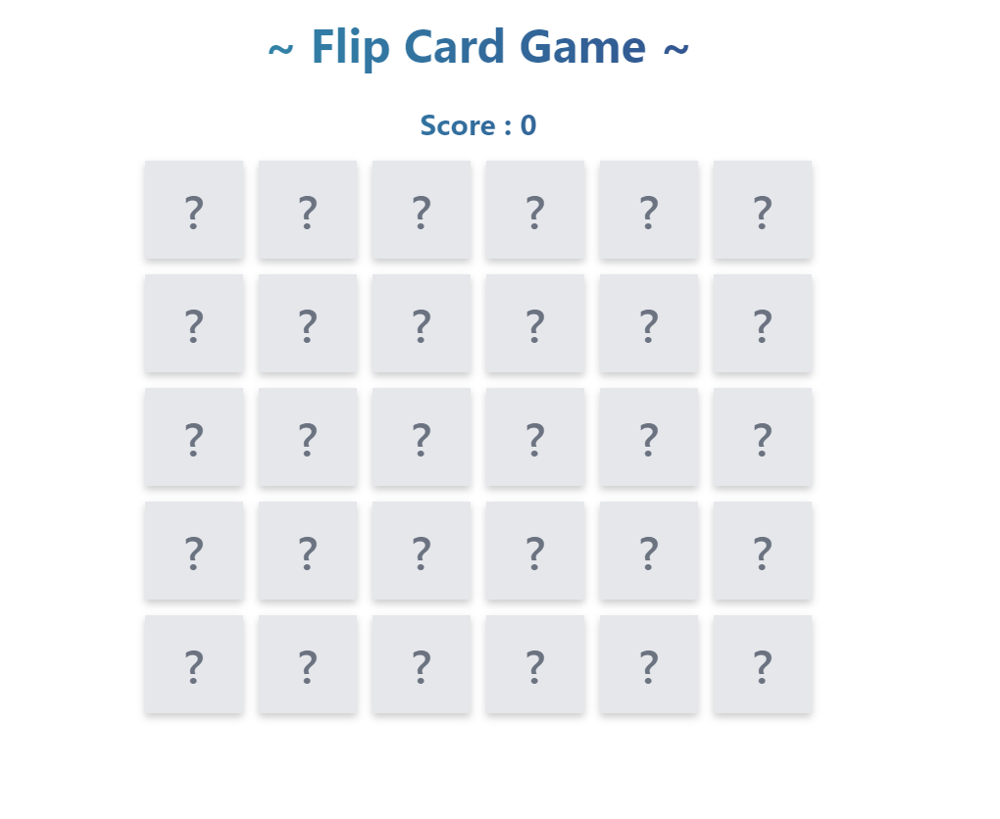
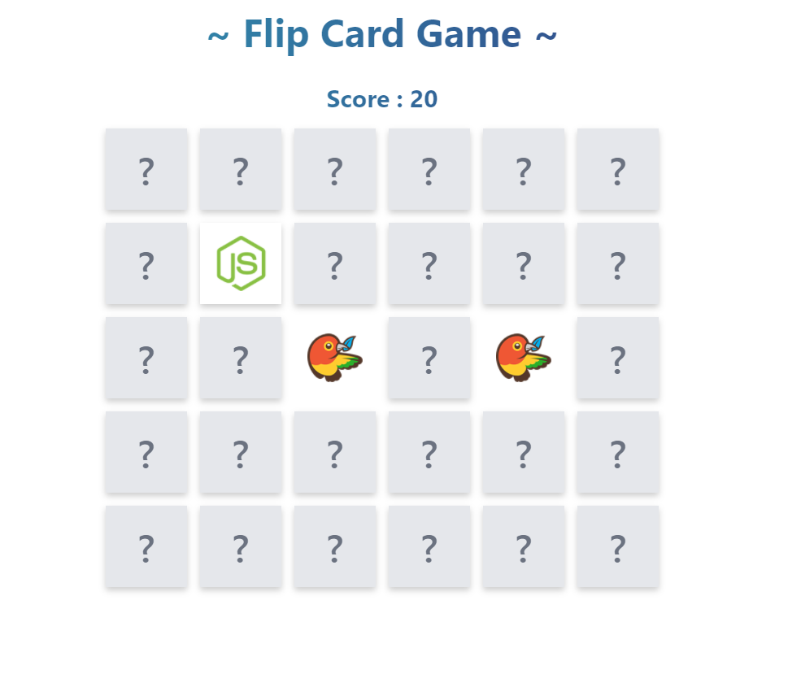
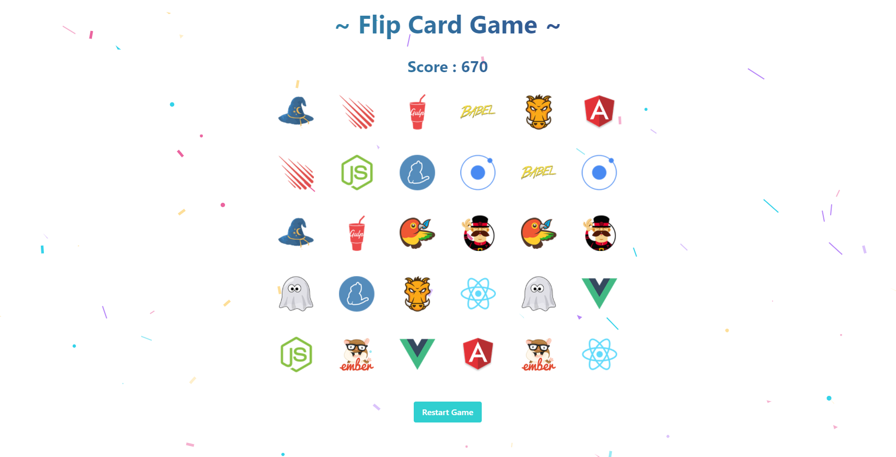

# Flip Card Game

This project maded by using tailwind, tpyescript, redux-toolkit also  used confetti-js for end game confetti and react-flippy for cards.

# Demo 

---

# Installation

### First 
### `yarn` | `npm install`

### then 
### `yarn start` | `npm run start`

# Screenshots

