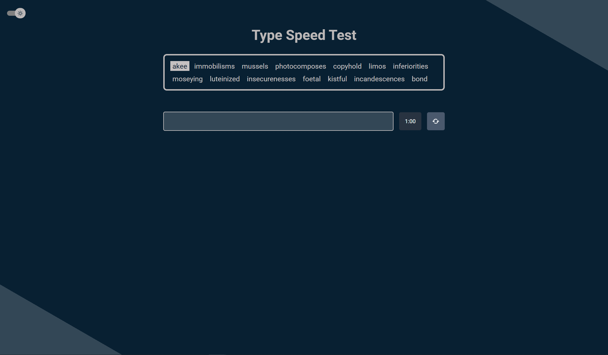
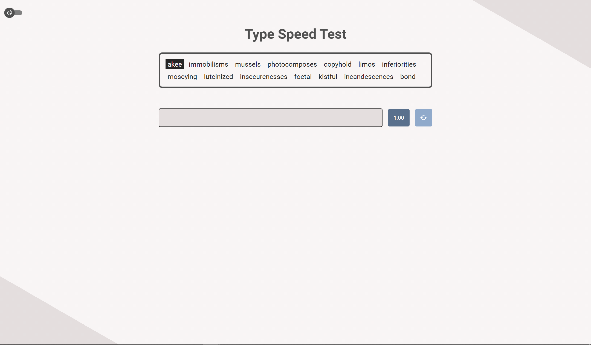
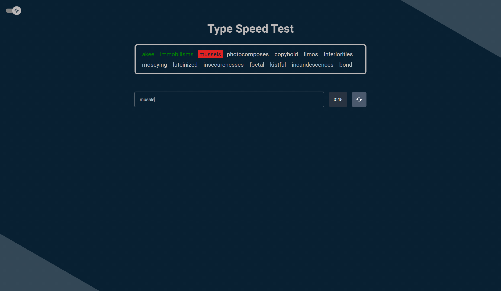
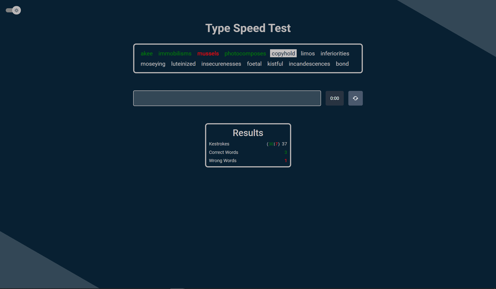

# Type Speed Test

I have used [this api link](https://random-word-api.herokuapp.com/word?number=1000) for random words. That's generate 1000 words for us. You have 60 seconds for the type, you should type fast as you can. 

# Installation

If you want to try on your local, you need to be clone this project first. After clone phase go to project directory and type  **yarn** to terminal. If your 3000 port is avaliable you shoul see the project on localhost:3000.

# Demo

[Demo link](https://ersincakmak-type-speed-test.netlify.app/)

# Screenshots 

